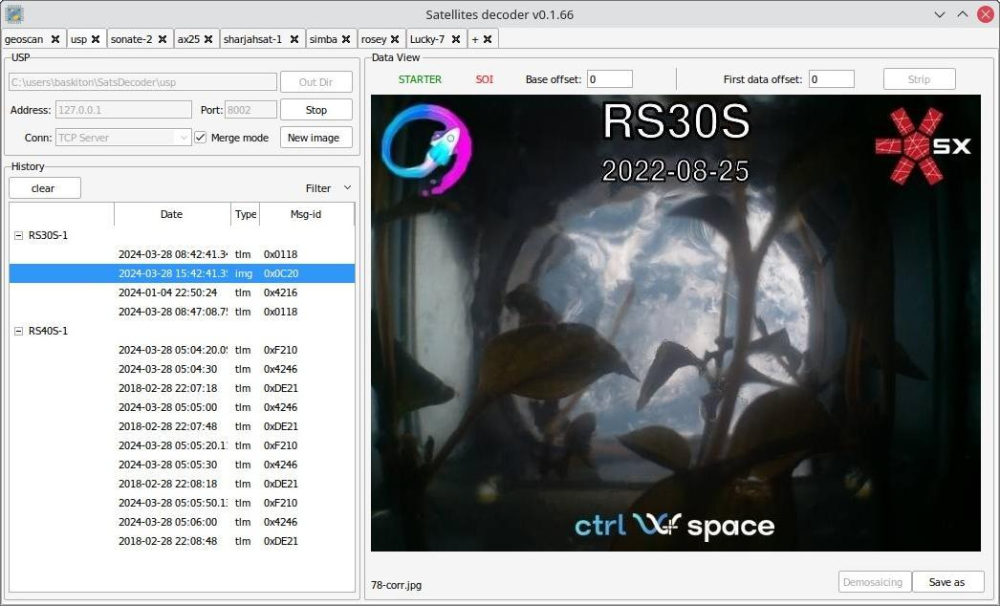

# Satellites decoder

Image and Telemetry decoder for some amateurs satellites (geoscan, sputnix platforms...)

First, download, setup and run soundmodem  
https://r4uab.ru/settings-soundmodem/  
* geoscan: [1](https://r4uab.ru/program/modem/geoscan.zip)
* usp: [1](http://viewnok.sputnix.ru/lib/exe/fetch.php?media=gmskusp.zip), [2](http://uz7.ho.ua/gmskusp.zip)

To start decoding, run SatsDecoder, select protocol tab and press "Connect" button. Play FM demodulated signal
and wait for result.

#### Options
* `Out Dir` Directory to store result images and telemetry
* `Server` Hostname or IP-address of soundmodem
* `Port` Port of soundmodem (see in File -> Devices -> AGWPE Server Port)
* `Merge mode` When enabled, all new images data will store to one file
* `New Image` Force a new image


#### Hotkeys
* `Ctrl-Q` Quit
* `F1` Show About window, check if newer version available


#### Protocols
The following protocols are currently supported:
* `GEOSCAN` - [Geoscan platform](https://download.geoscan.aero/site-files/%D0%9F%D1%80%D0%BE%D1%82%D0%BE%D0%BA%D0%BE%D0%BB%20%D0%BF%D0%B5%D1%80%D0%B5%D0%B4%D0%B0%D1%87%D0%B8%20%D1%82%D0%B5%D0%BB%D0%B5%D0%BC%D0%B5%D1%82%D1%80%D0%B8%D0%B8.pdf)
* `USP` - [Unified SPUTNIX protocol](https://sputnix.ru/tpl/docs/amateurs/%D0%9E%D0%BF%D0%B8%D1%81%D0%B0%D0%BD%D0%B8%D0%B5%20%D0%BF%D1%80%D0%BE%D1%82%D0%BE%D0%BA%D0%BE%D0%BB%D0%B0%20USP%20v1.04.pdf)




### Run from source
Required at least Python 3.7  
I recommend to use a virtual environment

Install required packages:
```commandline
pip install -r requirements.txt
```

To run:
```commandline
python -m SatsDecoder
```


### Build from source
Required at least Python 3.7  
I recommend to use a virtual environment

* Pyinstaller
    ```commandline
    pip install -r requirements.txt
    pip install pyinstaller
    pyinstaller -y decoder.spec
    ```

* Nuitka
    ```commandline
    pip install -r requirements.txt
    pip install nuitka
    python -m nuitka python -m nuitka --python-flag=-m --onefile --standalone \
        --assume-yes-for-downloads --output-dir=dist --script-name=SatsDecoder \
        --enable-plugins=tk-inter --windows-icon-from-ico=res/icon.png \
        --include-data-dir=res=res --noinclude-data-files=res/*.txt
    ```

The result build can be found in the `dist` folder